<h1>Ecommerce Micro services Project</h1>

<h4>Creation des micro services</h4>
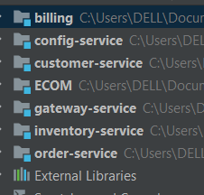
<h4>Configuration des fichiers applications.properties</h4>
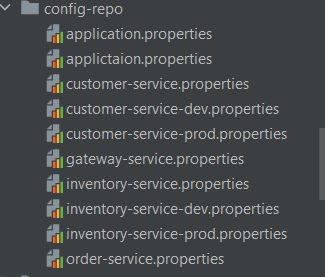
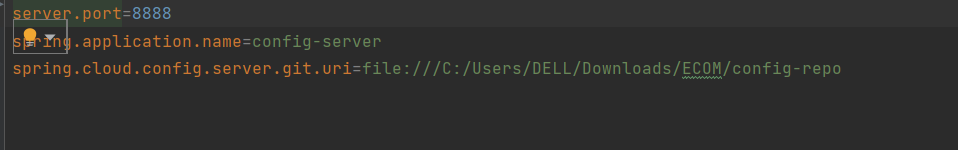
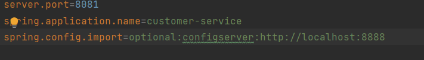
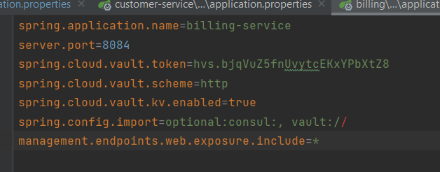
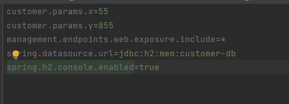
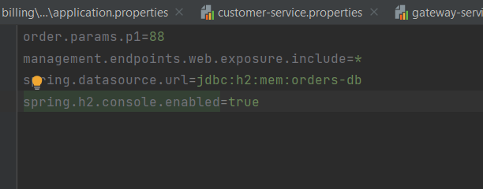
<h4>Creation des entités et repositories et projection</h4>
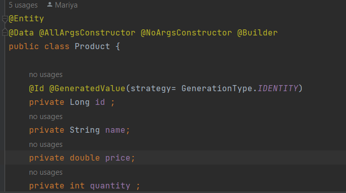

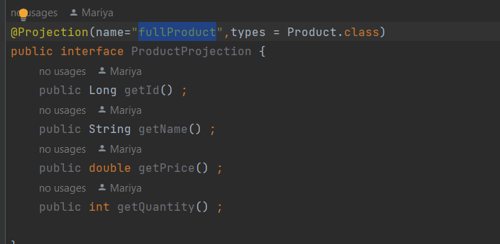
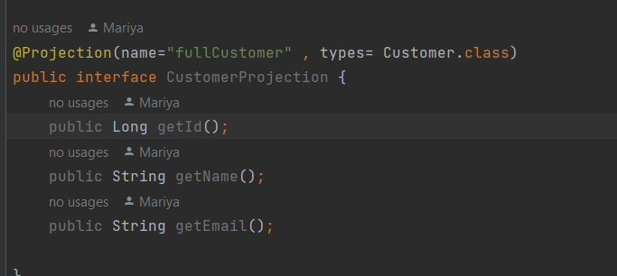

<h4>Creation des RESTControllers</h4>
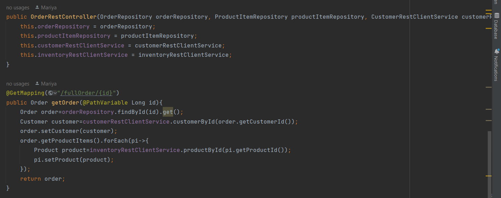
<h4>Creation des services CustomerRestClient InventoryRestClient</h4>
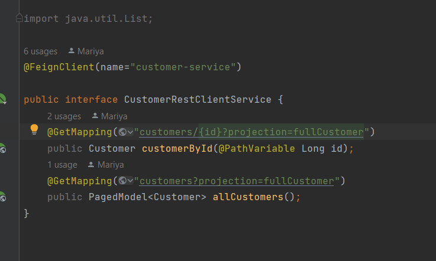
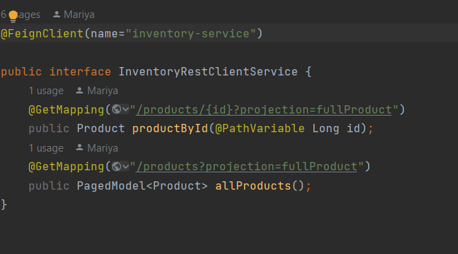

<h4>micro service Billing avec consul&Vault Config: </h4>

<h4>test des apis  : </h4>
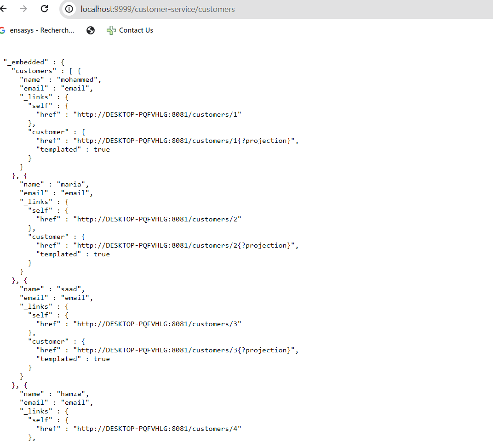
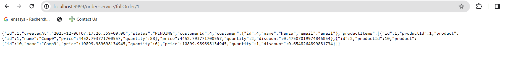
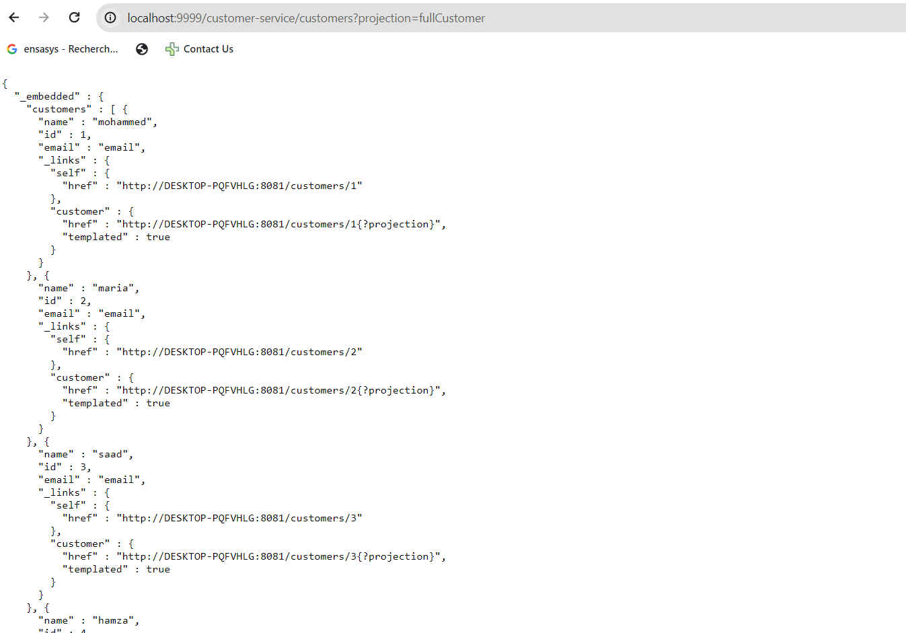
